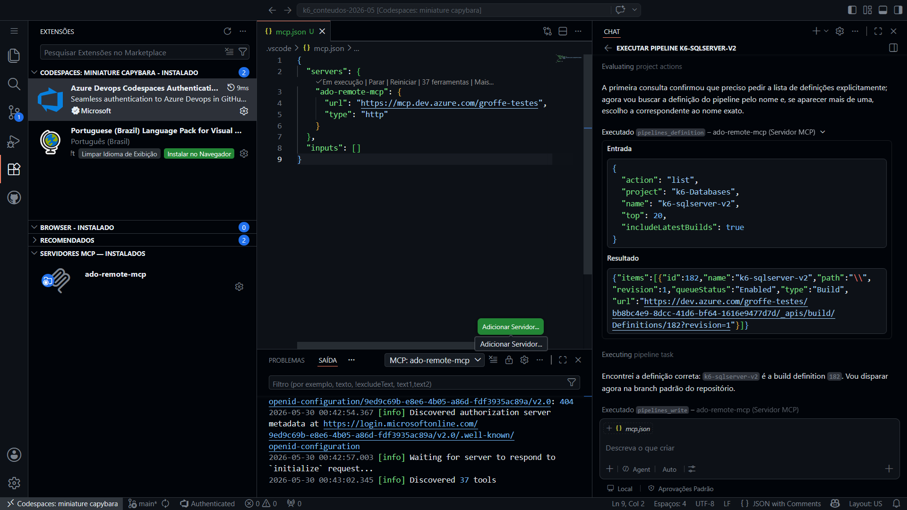

# k6_conteudos-2026-05
Materiais de apoio abordando o uso do Grafana k6 com diferentes tecnologias.

Apresentação recente (30/05/2026) abordando o uso do Grafana k6: **https://www.youtube.com/watch?v=YotQYkVlDc0**

## Exemplos de uso do k6

- Pipeline do Azure DevOps para automação de testes de carga de uma API REST (inclui geração de relatórios no formato HTML): https://github.com/renatogroffe/k6-loadtests-azuredevops-api-html-dashboard
- Workflow do Azure DevOps para automação de testes de carga de uma API REST (inclui geração de relatórios no formato HTML): https://github.com/renatogroffe/k6-loadtests-githubactions-githubpages-api-html-dashboard
- Testando um MCP Server (execução via docker run) com k6 a partir de um pipeline do Azure DevOps e sem o uso de uma IA Generativa: https://github.com/renatogroffe/k6-mcps-tests-azdevops-pipelines
- Testando um MCP Server (execução via dnx de um package NuGet) com k6 a partir de um pipeline do Azure DevOps e sem o uso de uma IA Generativa: https://github.com/renatogroffe/k6-mcps-tests-dnx-azdevops-pipelines
- Testando um MCP Server (execução como uma Web App na nuvem) com k6 a partir de um pipeline do Azure DevOps e sem o uso de uma IA Generativa: https://github.com/renatogroffe/k6-mcps-tests-http-azdevops-pipelines

https://github.com/renatogroffe/k6-kubernetes_operator-githubactions-loadtests_http

https://github.com/renatogroffe/k6-kubernetes_operator-azuredevops-loadtests_http

https://github.com/renatogroffe/k6-buildextensions-postgres-loadtests-azdevops-pipelines

https://github.com/renatogroffe/k6-buildextensions-mysql-loadtests-azdevops-pipelines

https://github.com/renatogroffe/k6-buildextensions-sqlserver-loadtests-azdevops-pipelines

## Executando pipelines de k6 no Azure DevOps via GitHub Codespaces + MCP

Executando um pipeline do k6 (testes com banco de dados) via Codespaces:

